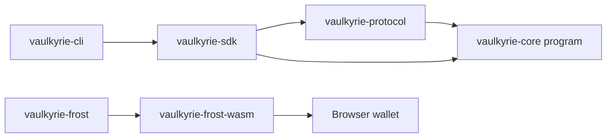
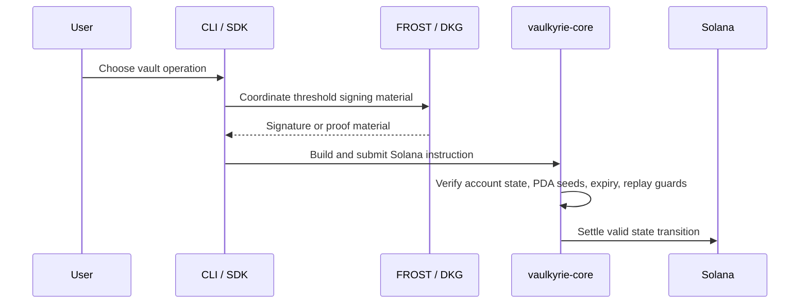

# Vaulkyrie MPC Wallet

Vaulkyrie MPC Wallet is the Rust and Solana core for the Vaulkyrie wallet suite. It focuses on threshold wallet coordination, Solana instruction construction, post-quantum recovery primitives, and operator tooling that can later be published as crates and a CLI.

> **Early-stage software:** this repository has not completed a formal third-party security audit. Treat it as development and research infrastructure, use devnet/test funds only, and do not rely on it for production custody until audits, release hardening, and published package versions are complete.

## What This Repository Contains



| Area | Purpose |
| --- | --- |
| `crates/vaulkyrie-protocol` | Canonical encodings, hashes, statements, Winternitz helpers, and protocol constants. |
| `crates/vaulkyrie-sdk` | Rust SDK helpers for program IDs, PDAs, account decoding, instruction builders, and client-side error mapping. |
| `crates/vaulkyrie-cli` | Operator and developer CLI over SDK flows, PDA derivation, error decoding, and protocol harnesses. |
| `crates/vaulkyrie-frost` | Threshold signing and DKG research harnesses for Solana-style signing flows. |
| `crates/vaulkyrie-frost-wasm` | Browser-facing WASM bindings used by the extension-side DKG and signing UI. |
| `programs/vaulkyrie-core` | Pinocchio Solana program for settlement, coordination state, replay protection, and PQC authority transitions. |

## Architecture

Vaulkyrie separates custody into several layers:



The on-chain program should stay lean. It stores coordination and authority state, but threshold shares, raw DKG transcripts, private policy inputs, and one-time signing secrets remain off-chain.

## Quick Start

Install Rust and Solana-compatible tooling, then run:

```bash
cargo build --workspace
cargo test --workspace
```

Run the CLI locally:

```bash
cargo run -p vaulkyrie-cli -- --help
cargo run -p vaulkyrie-cli -- decode error --code 6000
```

Derive a vault PDA:

```bash
cargo run -p vaulkyrie-cli -- pda vault-registry \
  --wallet <WALLET_PUBLIC_KEY> \
  --program <PROGRAM_ID>
```

## SDK and CLI Publication Plan

The Rust SDK and CLI are present in the workspace, but they should be treated as local developer tools until the release process is completed.

To publish them safely:

1. Finalize crate metadata: version, license, repository, README, keywords, and package include/exclude rules.
2. Ensure internal workspace dependencies include publishable versions, not only local `path` dependencies.
3. Publish dependency crates first, starting with `vaulkyrie-protocol`.
4. Publish `vaulkyrie-sdk` after it depends on the released protocol crate version.
5. Publish `vaulkyrie-cli` after SDK and protocol versions are available.
6. Run dry-runs before each publish:

```bash
cargo publish -p vaulkyrie-protocol --dry-run
cargo publish -p vaulkyrie-sdk --dry-run
cargo publish -p vaulkyrie-cli --dry-run
```

After publishing, users should be able to install the CLI with:

```bash
cargo install vaulkyrie-cli
```

## Development Notes

- Do not hardcode secrets, RPC credentials, private keys, DKG shares, or one-time signing material.
- Keep Solana program changes deliberate because deployed program changes require redeployment and client compatibility work.
- Prefer adding tests around encoding, PDA derivation, instruction data, and replay/expiry behavior before changing protocol logic.

## Official Links

- Website: https://www.vaulkyrie.xyz/
- Documentation: https://vaulkyrie.mintlify.app/
- GitHub: https://github.com/Vaulkyrie
- X: https://x.com/vaulkyrie_hq
